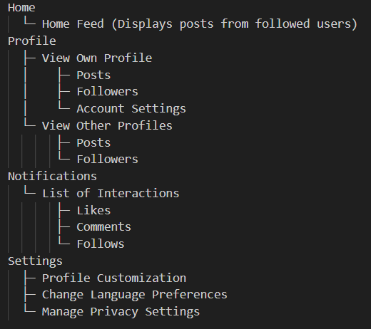
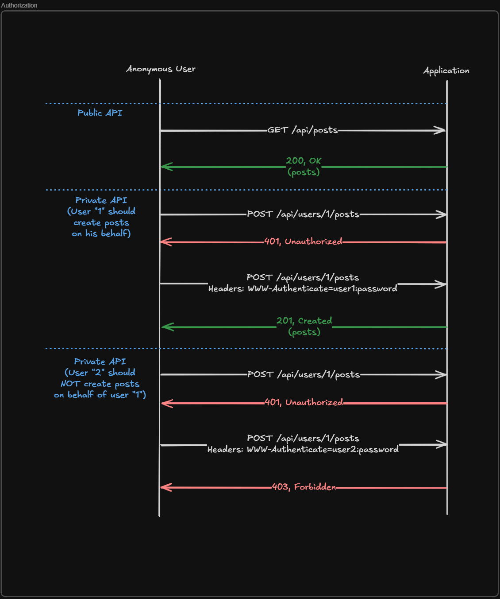
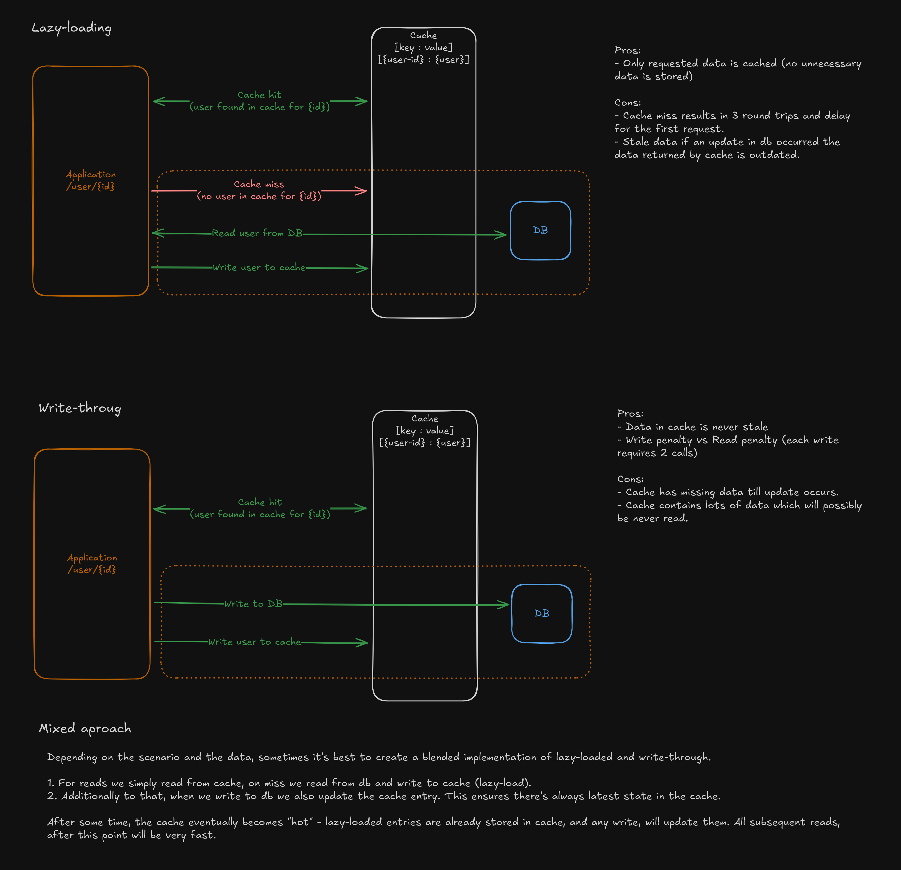

# Project phase 1 - Definition and planning

The project will focus on creating a social network platform. It's core reqirements are:

**High-level:**
- Web app for high availability
- Fullstack project

**Features:**
- Social login via Google / profile customization - picutre, desctription
- Cross user interaction - follow, un-follow
- User interactions - create new post, remove post, comment, like
- User notifications - on post like, on post comment, on follow

---

## 1. User Personas

### Persona 1: Emily, 14 - Student and Social Media Enthusiast

**Demographics**
- **Age:** 14
- **Occupation:** High School Student
- **Location:** Urban area, USA
- **Education:** Currently in high school
- **Relationship Status:** Single lives with parents, active in social circles and online communities

**Goals/Needs**
- **Primary Goal:** Stay updated with the latest gossip, trends, and makeup tutorials.
- **Secondary Goals:** Keep in touch with friends and share personal moments.
- **Platform Needs:**
    - Easy-to-navigate feed with trending news and videos.
    - Ability to follow influencers and friends for content and updates.
    - Tools to share selfies, makeup tips, and personal moments.

**Pain Points**
- **Challenges:** Often overwhelmed by irrelevant content or spammy posts on other platforms.
- **Barriers:** Dislikes overly complicated apps or features that aren't straightforward.
- **Concerns:** Privacy issues around sharing personal moments and makeup tutorials.

**Behavior**
- **Content Consumption:** Frequently watches makeup tutorials, celebrity gossip, and lifestyle content.
- **Interactivity:** Likes, comments, and shares posts from friends, influencers, and makeup artists.
- **Platform Usage:** Checks social media multiple times a day (several hours), spends time scrolling and watching videos.
- **Device Usage:** Primarily uses her smartphone, sometimes uses a tablet or laptop for research or video watching.
- **Community Engagement:** Actively follows beauty influencers and gossip channels; engages in conversations with friends and fellow fans.

**Tech Savviness**
- **Tech Knowledge:** Intermediate. She’s highly familiar with social media apps and is quick to adopt new platforms.
- **Device Comfort:** Uses her smartphone for almost all social media activities, including video uploads and content consumption.
- **Adaptability:** Quickly learns new features and enjoys exploring hidden or advanced features of apps.

**Additional Insights:**
- **Content Focused on Self-Expression:**  
  Emily thrives in environments that let her showcase her creativity and personality. The platform should allow her to personalize her experience—whether through customized profiles, themed backgrounds, or the ability to share makeup tutorials, personal stories, or fashion tips. Features like interactive filters or a fun, creative space will keep her engaged.
- **Peer Validation & Social Comparison:**  
  Emily is motivated by peer validation and recognition. Likes, shares, and comments play an important role in shaping how she interacts with content. The platform should encourage engagement by making social interactions more rewarding, such as through badges or achievements for posting trendy content or gaining followers.
- **Social Influence and Trends:**  
  Emily is highly influenced by her peer group and current trends. She loves being the first to adopt new challenges or viral content. The platform should support discovery features, such as a trending section, or tools that let her jump into viral challenges easily. Integrating features like "challenges" or collaborative trends would keep her excited and motivated to participate.
- **FOMO (Fear of Missing Out):**  
  Emily experiences FOMO, especially around new trends, gossip, or makeup tutorials. Notifications about trending topics, viral content, and new beauty product releases are essential. The platform should offer real-time updates and push notifications to ensure that she never feels left behind on what's trending.
- **Privacy Awareness & Parental Controls:**  
  As a 14-year-old, Emily is still learning how to navigate privacy concerns. The platform should offer robust parental control features to ensure her safety while allowing her to express herself freely. Clear privacy settings and tools that let her control who sees her posts (friends only, public, etc.) will make her feel more secure. A "Safe Mode" for younger users could provide peace of mind for both Emily and her parents.
- **Learning & Discovery:**  
  While Emily loves social interaction, she also enjoys learning new things like makeup techniques or trends. The platform can offer curated learning content or tutorials based on her interests, allowing her to further explore her passions. Integrating short, easy-to-follow guides or challenges related to beauty or fashion can increase engagement.
- **Influencers & Mentorship:**  
  Emily is very much into influencers and looks up to them. She often looks for role models within the beauty and fashion space. The platform should have easy ways for her to follow influencers, watch live streams, and interact with them. Mentorship-style interactions—such as live Q&A sessions or influencer-led tutorials—would create additional engagement opportunities.
  
---

### Persona 2: Sarah, 30 - Marketing Specialist

**Demographics**
- **Age:** 30
- **Occupation:** Marketing Specialist
- **Location:** Urban area, UK
- **Education:** Bachelor’s degree in Business and Marketing
- **Relationship Status:** Single, lives in a shared flat with friends

**Goals/Needs**
- **Primary Goal:** Stay connected with colleagues and friends while managing her work-life balance.
- **Secondary Goals:** Share marketing tips, discover new trends in digital marketing, and network with other professionals.
- **Platform Needs:**
  - Easy, quick ways to connect with friends and colleagues.
  - Customizable profile with professional and personal content.
  - Notifications about new trends, posts, or work-related events.

**Pain Points**
- **Challenges:** Feels overwhelmed by constant emails and social media notifications, making it hard to prioritize content.
- **Barriers:** Hates cluttered, difficult-to-navigate platforms that have too many features. Wants a streamlined interface with relevant notifications only.

**Behavior**
- **Content Consumption:** Mainly reads articles and views posts that relate to her profession. Occasionally shares personal moments or work milestones.
- **Interactivity:** Often likes and shares posts related to marketing, occasionally comments on professional articles.
- **Platform Usage:** Checks her social feed 2-3 times a day, spends about 15-30 minutes per session.
- **Device Usage:** Primarily uses mobile but will access the platform on desktop during work hours.
- **Community Engagement:** Primarily engages with colleagues and industry influencers, but occasionally interacts with close friends.

**Tech Savviness**
- **Tech Knowledge:** Intermediate. She is comfortable with digital platforms and expects them to have some level of customization and functionality.
- **Device Comfort:** Uses both mobile and desktop devices for different tasks; she’s comfortable switching between them.
- **Adaptability:** Enjoys new features and is quick to adapt when a feature improves the user experience.

**Additional Insights**
- **Work-Life Balance:** Sarah is always trying to balance her demanding career with her personal life. She often seeks ways to stay productive without sacrificing social connections or personal time. The platform should help her manage these priorities, offering options to filter notifications and manage her time effectively.
- **Networking:** Sarah is active on professional networks, attending virtual marketing webinars, and engaging with industry leaders. She expects a platform that provides networking opportunities, both informal and formal, allowing her to connect with people who can help her advance in her career.
- **Content Customization:** As someone who is in marketing, Sarah is likely to be interested in tailoring her feed to show relevant content. Features like customizable news feeds and hashtags would appeal to her, so she can follow the latest marketing trends without the distraction of irrelevant content.
- **Privacy & Security:** Sarah is conscious about her online presence, balancing her professional brand with her personal life. Therefore, the platform should allow easy control over who can see her work-related posts versus personal updates. A customizable privacy setting for both content and personal information is key.
- **Social Impact:** As a marketing professional, Sarah may be inclined to use platforms that align with her values, such as supporting causes or advocating for corporate social responsibility (CSR). The platform could include features like sharing nonprofit causes or business sustainability posts.

---

### Persona 3: Tom, 40 - Freelancer (Designer)

**Demographics**
- **Age:** 40
- **Occupation:** Freelance Graphic Designer
- **Location:** Suburban area, Canada
- **Education:** College diploma in graphic design
- **Relationship Status:** Married, father of two

**Goals/Needs**
- **Primary Goal:** Share his design work and get feedback from others.
- **Secondary Goals:** Build his personal brand and connect with potential clients.
- **Platform Needs:**
  - An easy-to-use platform to post and showcase his designs.
  - Interactions like comments and likes to build a professional network.

**Pain Points**
- **Challenges:** Struggles to get exposure among a large number of creators.
- **Barriers:** Needs a platform that offers simple and clean design tools. Doesn't like apps with unnecessary features.

**Behavior**
- **Content Consumption:** Regularly scrolls through design inspiration, likes and comments on posts from other designers.
- **Interactivity:** Actively engages with fellow designers, commenting on designs, and sharing his own work.
- **Platform Usage:** Logs into the platform once or twice a day, usually for 30-40 minutes.
- **Device Usage:** Primarily uses desktop for uploading designs and mobile to check updates.
- **Community Engagement:** Strong interaction with fellow designers, more passive engagement with friends.

**Tech Savviness**
- **Tech Knowledge:** Advanced. Tom is very comfortable with technology and prefers platforms with advanced customization options.
- **Device Comfort:** Uses both desktop and mobile devices; prefers working on desktop for tasks that need precision.
- **Adaptability:** Quick to adopt new tools, especially those that enhance his workflow or creative process.

**Additional Insights**
- **Creative Showcase:** Tom views social media primarily as a tool to showcase his creative work. The platform should have easy-to-use features for uploading high-quality images of his designs, along with tools that allow for easy formatting and presentation of his portfolio.
- **Exposure:** Tom struggles with getting noticed among many other creators. The platform should provide ways for users to gain visibility, whether through a "featured" section, hashtags for greater discoverability, or a platform algorithm that promotes good design content to more people.
- **Freelance Opportunities:** Tom’s main goal is to use the platform as a way to attract clients and projects. The ability to directly message or make connections with potential clients through professional networking tools would be highly valuable. A “portfolio” feature where Tom can showcase his work and link to freelance job postings would be ideal.
- **Community Collaboration:** Tom thrives in a community of like-minded professionals. Features that allow collaboration on projects, design challenges, or group discussions on design trends would be highly beneficial. The platform should support a collaborative culture, where designers can give and receive constructive feedback.
- **Content Curation:** Given his busy freelance schedule, Tom might appreciate curated content that highlights the latest trends, tools, and resources in design, so he can stay updated without needing to search for it.
- **Stress-Free Interaction:** Tom values a no-fuss, clean interface that enables him to focus on his work. Cluttered features or confusing navigation could frustrate him. A straightforward user interface that enables him to easily navigate through the platform would be essential.

---

### Persona 4: John, 68 - Retired Teacher and Politically Engaged

**Demographics**
- **Age:** 68
- **Occupation:** Retired Teacher
- **Location:** Rural area, UK
- **Education:** Bachelor’s degree in Education
- **Relationship Status:** Married, with children and grandchildren

**Goals/Needs**
- **Primary Goal:** Stay informed about political news and current affairs.
- **Secondary Goals:** Stay in touch with family and friends, particularly his children and grandchildren.
- **Platform Needs:**
    - A simple, easy-to-navigate news feed for political updates.
    - The ability to share updates with his family and comment on posts.
    - Privacy and security features to feel comfortable sharing information online.

**Pain Points**
- **Challenges:** Difficulty understanding new technology and navigating complex interfaces.
- **Barriers:** Dislikes confusing apps, constant updates, and complicated logins.
- **Concerns:** Security and privacy are major concerns, especially sharing personal information online.
- **Frustrations:** Finds most social media platforms overwhelming with excessive content, ads, or notifications.

**Behavior**
- **Content Consumption:** Primarily reads political articles and watches news programs.
- **Interactivity:** Interacts mainly with posts from his children, friends, or family members. Occasionally comments on political discussions.
- **Platform Usage:** Uses the platform mostly in the mornings, for about 30-45 minutes, to catch up on the latest news and check family updates.
- **Device Usage:** Primarily uses a tablet for browsing, occasionally uses a desktop computer for longer reading sessions.
- **Community Engagement:** Active in family-related posts but prefers not to engage in many public discussions or debates.

**Tech Savviness**
- **Tech Knowledge:** Beginner. While familiar with basic functions of devices like tablets and smartphones, he struggles with complex apps or features.
- **Device Comfort:** Comfortable with his tablet and occasionally uses his desktop computer. He prefers not to use his phone for browsing or commenting.
- **Adaptability:** Slow to adapt to new technology but will embrace it if it's easy to use and meets his needs.

**Additional Insights**
- **Need for Simplicity & User-Friendly Design:**  
  John values clarity and ease of use. He doesn’t want to be overwhelmed by excessive features or complicated settings. The platform should have an intuitive design with simple navigation, clear call-to-action buttons, and an easy layout. Large, legible fonts, an uncluttered interface, and simple icons are key to creating a positive experience for him.
- **Social Connection with Family & Friends:**  
  The primary reason John uses social media is to stay connected with his family and friends. A platform that prioritizes family communication tools—such as private messaging, video calls, and family-specific groups—will be especially valuable. Features that make sharing personal milestones (such as grandchildren's birthdays or family gatherings) easy and private will enhance his user experience.
- **Content Focused on Politics & Education:**  
  John is politically engaged and passionate about education. He will be drawn to platforms that offer access to credible news sources, political discussions, and educational content. The platform should allow users to follow specific political topics or educators and receive notifications on updates or new discussions, ensuring he’s always up to date with the issues that matter most.
- **Avoiding "Noise" in Content:**  
  John is not interested in the typical fast-paced, trend-driven content that often populates social media. He values depth and substance. The platform should filter out irrelevant or shallow content and give him access to more thoughtful and meaningful discussions. A content moderation system that emphasizes reliable news sources and quality discourse will appeal to him.
- **Security & Privacy Concerns:**  
  Given John's age, online security is a major concern. The platform should have clear, simple privacy controls that allow him to manage who sees his posts and personal information. The option for secure, family-only groups or easily accessible tutorials on privacy settings would make him feel more comfortable engaging with the platform. Educating him on how to protect his data while using the platform should also be a priority.
- **Civic Engagement & Advocacy:**  
  John values platforms that help him stay informed about political causes and social issues. He is likely to be interested in using social media for advocacy, whether sharing educational content or promoting causes he believes in. Features that allow users to support causes, sign petitions, or participate in discussions about important issues will appeal to his need to contribute positively to society.
- **Supporting Learning & Thoughtful Content:**  
  John is an educator at heart, and he enjoys platforms that offer opportunities for learning and intellectual engagement. Educational resources on topics such as history, politics, or global issues would draw him in. Features like discussion forums, educational webinars, and articles about political developments could help him feel more intellectually stimulated and engaged.
- **Building a Legacy:**  
  As a retired teacher, John may want to leave a lasting legacy by sharing his insights, stories, and knowledge. The platform should give him a way to share longer, more detailed posts, blog-style content, or even educational video lectures. Features that allow him to create a "profile" that showcases his years of experience and expertise would allow him to feel more valued on the platform.

---

## 2. Use Cases and User Flows

### Use Case / Usage Scenario 1: Profile Customization and Language Change

**Goal**
As a user, I want to customize my profile and change the language of the application.

**Context**
The user wants to update their profile with a new picture and description, and also change the interface language to suit their preference.

**Steps**
1. The user goes to their profile page by clicking on their avatar.
2. They click the "Edit Profile" button.
3. The user uploads a new profile picture and enters a brief description in the text box.
4. Below the description, the user selects a preferred language from a dropdown menu (Polish or English).
5. The user clicks "Save Changes."

**System’s Response**
- The system updates the profile picture and description on the user’s profile.
- The system saves the changes and reflects them immediately.
- The system updates the app’s interface to the selected language.

**Edge Cases**
- **File Size**: If the profile picture is too large, the system will prompt the user to upload a smaller image.
- **Empty Description**: If the user doesn’t add a description, the system will show a default placeholder or an error prompt.
- **Language Change Delay**: If there's a delay in updating the language, the system will show a loading spinner or message, and the interface will change once the update is successful.

---

### Use Case / Usage Scenario 2: Sharing a New Status Update

**Goal**  
As a user, I want to share a new status update with my friends.

**Context**  
The user opens the app during their free time to share a new thought or moment with their followers.

**Steps**  
1. The user opens the app from their smartphone or desktop.  
2. They navigate to their profile by clicking on their avatar.  
3. The user clicks the "Create New Post" button.  
4. They type a short description and attach an image/video.  
5. The user clicks "Post" to share it with their followers.  

**System’s Response**  
- The system updates their feed, showing the new post along with the attached content.  
- The system sends notifications to followers and contacts about the new post.  
- The system may feature the post on the platform if it gains engagement.  

**Edge Cases**  
- **Incorrect Data**: If the user tries to post without any text or image, the system shows an error, like "Please add a caption or image."  
- **Privacy Settings**: If the user has set specific privacy preferences, the post will be visible only to the chosen audience (e.g., only followers or specific groups).  
- **Slow Network**: If the connection is slow, the app will show a loading indicator and retry posting.  

---

### Use Case / Usage Scenario 3: Following and Unfollowing a User

**Goal**  
As a user, I want to follow or unfollow someone to stay updated on their posts.

**Context**  
The user wants to follow a friend or influencer to see their posts in their feed.

**Steps**  
1. The user navigates to the profile of the person they want to follow/unfollow.  
2. They click on the "Follow" or "Unfollow" button on the user’s profile page.  

**System’s Response**  
- If the user clicks "Follow," the system adds them to the following list and starts showing posts from that user in the feed.  
- If the user clicks "Unfollow," the system removes them from the following list, and their posts no longer appear in the feed.  

**Edge Cases**  
- **Already Following**: If the user is already following the person, clicking "Follow" will be disabled, and the user will see "You are already following this person."  
- **No Internet**: If there is no internet, the system will display an error message and attempt to reconnect.  

---

### Use Case / Usage Scenario 4: Commenting on a Post

**Goal**  
As a user, I want to comment on a post to interact with the content.

**Context**  
The user wants to comment on a friend's post to share their thoughts.

**Steps**  
1. The user opens the app and scrolls through their feed.  
2. They click on a post they want to comment on.  
3. They type a comment in the comment section and click "Post."  

**System’s Response**  
- The system updates the comment section to display the new comment.  
- The system sends a notification to the post owner about the new comment.  

**Edge Cases**  
- **Comment Too Long**: If the comment exceeds the character limit, the system will show an error and prompt the user to shorten the comment.  
- **Spam Filter**: If the comment contains flagged words or phrases, the system will block the comment and notify the user.  

---

### Use Case / Usage Scenario 5: Viewing Notifications for Post Interactions

**Goal**  
As a user, I want to receive notifications when someone likes or comments on my post or follows me.

**Context**  
The user wants to stay informed about interactions with their content and account.

**Steps**  
1. The user opens the app and navigates to the notifications tab.  
2. The user sees the latest notifications for post likes, comments, and new followers.  
3. The user clicks on a notification to view the post or the profile of the person who interacted.  

**System’s Response**  
- The system shows the relevant notification (like, comment, or follow).  
- The system highlights the post or user profile associated with the notification.  

**Edge Cases**  
- **Bulk Notifications:** If the user receives too many notifications at once, the system groups similar ones together (e.g., "5 people liked your post" instead of separate notifications).
- **Expired Notifications:** If a post is deleted or a user account is deactivated before the notification is checked, the system will remove or mark the notification as unavailable.
- **Duplicate Notifications:** If a user receives multiple identical notifications due to a system error, the app should filter out duplicates. 

---

## 3. UI Prototypes

Add something

---

## 4. Information Architecture and Technical Design

### Information Architecture

#### Overview

The platform follows a structured and intuitive information architecture to ensure smooth user navigation and efficient data organization. Key components include:

- **User Profiles**: Each user has a profile page displaying their posts, followers, and account settings. Users can view their own profile and check other users' profiles.
- **Posts & Feed**: Users can create posts, view others' posts in a feed, and interact with them.
- **Notifications**: Users receive real-time updates on likes, comments, and new followers.
- **Settings**: Users can customize their profiles, change language preferences, and manage privacy settings.

#### Navigation Flow

Users can navigate through the application as follows:

- **Home Feed**: Displays posts from followed users.
- **Profile Page**: Allows users to update personal information and view their content.
- **View Other Profiles**: Users can view the profiles of other users, including their posts and follower details.
- **Notifications**: Lists all interactions such as likes, comments, and follows.
- **Settings**: Provides account management options.

#### Sitemap

---

### Technical Design

#### Technology Stack

The application is built using modern technologies to ensure scalability, maintainability, and performance.

**Frontend:**
- **TypeScript** – Ensures type safety and maintainability for a scalable frontend.
- **React** – Provides a component-based architecture for building an interactive UI.
- **Tailwind** – Enables rapid and consistent styling with a utility-first approach.

**Backend:**
- **Kotlin** – Offers a concise, expressive, and safe language for backend development.
- **Spring Boot** – Facilitates rapid development with built-in support for web applications and APIs.
- **PostgreSQL** – Delivers a powerful, reliable, and scalable relational database solution.

**Real-Time Notifications:**
- **WebSockets** – Used for real-time updates, ensuring users are instantly notified of new interactions such as likes, comments, and follows.
- **AWS SNS** – AWS Simple Notification Service is utilized for sending notifications to users about interactions on their posts.

#### Architecture

The platform follows a client-server architecture:

- **Frontend (React, TypeScript)** communicates with the **Backend (Spring Boot, Kotlin)** via REST APIs.
- The backend interacts with the **PostgreSQL database** for storing user data, posts, and interactions.
- **WebSockets** are used to manage real-time notifications, providing immediate updates to users.
- **AWS SNS** is integrated to handle scalable notifications for large numbers of users.

#### Authorization

Authorization in the system follows a strict access control model to ensure users can only perform actions permitted to them.

**Public API**

Anonymous users can access public endpoints, such as retrieving posts (`GET /api/posts`).

**Private API**

**Authenticated User Actions**

- A user must authenticate to create posts under their own account (`POST /api/users/1/posts` with valid credentials).
- If an unauthenticated user attempts to create a post, the system returns **401 Unauthorized**.
- If the correct user authenticates, the request is allowed, returning **201 Created**.

**Restricted Actions**

- Users cannot create posts on behalf of another user.
- If an authenticated user (User "2") attempts to create a post for another user (User "1"), the system returns **403 Forbidden**.

This authorization flow ensures users can only modify their own data and prevents unauthorized actions on behalf of others.

**Authorization Diagram**

#### Data Flow

1. **User creates a post** → Frontend sends request to the backend → Post is stored in PostgreSQL → Followers are notified via WebSockets.
2. **User likes/comments on a post** → Action is recorded in the database → Post owner receives a real-time notification via WebSockets and AWS SNS.
3. **User follows another user** → Relationship is stored in the database → The followed user is notified via WebSockets and AWS SNS.
4. **User views another profile** → Profile data is fetched from the backend → The profile page is displayed with posts and follower information.

#### Deployment Strategy

- **Frontend Hosting**: Deployed on **AWS S3** for static website hosting, with **AWS CloudFront** for content delivery and caching.
- **Backend Hosting**: Hosted on **AWS EC2** using **Docker containers**.
- **Database**: Managed PostgreSQL instance on **AWS RDS**.
- **Dockerization**: Both frontend and backend applications are containerized using Docker for easy deployment and scalability on AWS services.

#### Security Measures

- **Authentication**: OAuth-based social login (Google Sign-In) and JWT tokens.
- **Data Protection**: HTTPS encryption and secure API endpoints.
- **Rate Limiting**: Prevents spam and abuse by limiting API requests per user.

#### Caching Strategy

Caching plays a crucial role in improving application performance by reducing the load on the database and speeding up data retrieval. Two caching strategies are currently being evaluated: **Lazy Loading** and **Write-Through**.

**Lazy Loading**
- **Description**: In lazy loading, the cache is populated only when the data is requested. If the data is not in the cache, it is fetched from the database and then added to the cache for subsequent requests.
- **Pros**:
  - Reduces the initial load time.
  - Saves memory by only caching frequently accessed data.
- **Cons**:
  - May result in slower initial response time as data is fetched from the database.
  - Increased load on the database in case of many cache misses.

**Write-Through Caching**
- **Description**: In write-through caching, data is written to both the cache and the database simultaneously. This ensures that the cache is always up-to-date with the database.
- **Pros**:
  - Ensures cache consistency with the database.
  - Faster read operations as data is immediately available in the cache.
- **Cons**:
  - Slightly higher write latency due to the need to update both the cache and database.
  - More memory usage as all changes are cached.

**Caching Strategy Decision**

The best approach will be determined based on factors such as data consistency requirements, performance needs, data access patterns, the need for real-time data, and the overall impact of caching on application performance.

**Caching Strategy Diagram**

#### Future Enhancements

- Implementing **GraphQL** for more flexible data retrieval.
- **AI-based content recommendations**.
- **Native mobile application** using React Native.

---

## 5. Project Management and User Testing

### Project Management Plan:

### User Testing Plan:
