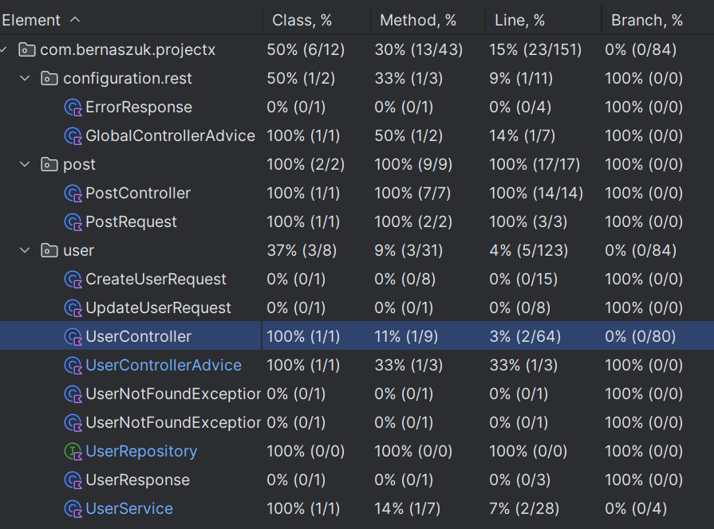

# Project Phase 2 - Basic Structure and Main Functionalities

This document describes the basic structure and main functionalities of the current version of the application.

---

## 1. Environment

Currently, the application runs only locally. If time allows, a future version will be hosted on an AWS service.

---

## 2. Backend

The backend server is written in **Kotlin** and uses **Gradle** to manage building, dependency resolution, compiling, testing, and packaging. It leverages the following Spring libraries:

- **Spring Boot** – Simplifies managing the Spring application lifecycle
- **Spring Framework** – Core application functionality
- **Spring Data** – Manages data persistence with the database

For testing, **JUnit** is used.

Data is stored in a **PostgreSQL** database, and **Flyway** is used for database versioning and migration.

➡️ [GitHub - Backend Repository](https://github.com/berniq/XWebBackend)

---

## 3. Frontend

As of now, no frontend has been developed yet.

➡️ [GitHub - Frontend Repository](https://github.com/berniq/XWebFrontend) Only void awaits those who enter

---

## 4. Database

**PostgreSQL** is used to store data related to users and posts.

---

## 5. Basic Structure and Architecture

The backend is built using **Spring Boot** with **Kotlin**, and follows a clean, layered architecture. Business logic is separated into dedicated components: `Controller`, `Service`, `Repository`, and `DTO` packages.

The system uses **PostgreSQL** for persistent storage, and **Flyway** ensures consistent and safe database schema migrations across environments.

The REST API is structured around two main resources: **User** and **Post**. Endpoints are RESTful and intuitive, embedding user identification directly within the URL structure.

### Supported Endpoints

#### **Post Endpoints**
- `POST /users/{userId}/posts` – Create a new post for a specific user  
- `GET /posts/{postId}` – Retrieve a post by ID  
- `GET /users/{userId}/posts` – Retrieve all posts from a specific user  
- `PATCH /users/{userId}/posts/{postId}` – Update a post (only by the author)  
- `DELETE /users/{userId}/posts/{postId}` – Delete a post (only by the author)

#### **User Endpoints**
- `GET /users` – Retrieve a list of all users  
- `GET /users/@{userName}` – Retrieve a user by their username  
- `GET /users/{userId}` – Retrieve a user by ID  
- `PUT /users/{userId}` – Update a user’s data  
- `DELETE /users/{userId}` – Remove a user from the system

Only post authors are allowed to modify or delete their own content, enforcing a basic access control mechanism.

### Additional Developer Tools

The project includes a `/dev` directory with:

- `db-seed/` – SQL scripts (`customer.sql`, `post.sql`) for pre-populating the database  
- `http-client/` – `.http` files for testing REST endpoints (`post-rest-api.http`, `user-rest-api.http`) directly in IntelliJ or a compatible tool

This setup enhances developer experience and speeds up local development and testing.

---

## 6. Functionalities

Currently, the application allows for basic data manipulation through REST endpoints with validation of request bodies and parameters. Implemented functionalities include:

- **User entity** – Full CRUD support  
- **Post entity** – Full CRUD support, with deletion and modification restricted to the post's author

---

## 7. Code Quality and Documentation

The code is organized by feature, with separate packages for each entity (e.g., `user`, `post`) containing their respective `Repository`, `Service`, and `Controller` classes. `DTO`s are used to clearly define data structures being transferred, and custom exceptions are defined per entity to enhance error clarity.

While code comments and technical documentation are limited at this stage, the structure follows standard conventions and uses `ktlint` for formatting, which makes the logic easy to follow and maintain.

---

## 8. Testing and Error Handling

Currently, tests focus mostly on **Post** functionality. Tests for the **User** entity are under development, as recent updates added data validation. Integration testing is done using the **JUnit** framework.

### Test Coverage:

REST endpoints have been tested using the tools provided in the `/dev/http-client/` directory.

For error handling:
- `UserControllerAdvice` and `PostControllerAdvice` are used to handle entity-specific exceptions
- `GlobalControllerAdvice` standardizes error responses across the application

---

## 9. User Interface and Interaction

As no frontend is implemented yet, the user is left staring into the void — eagerly awaiting the release of the next version.
